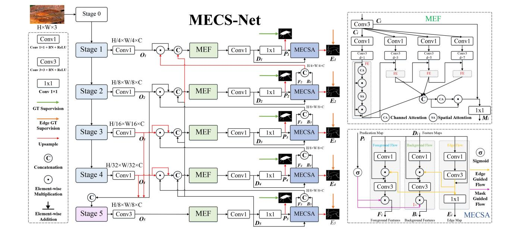
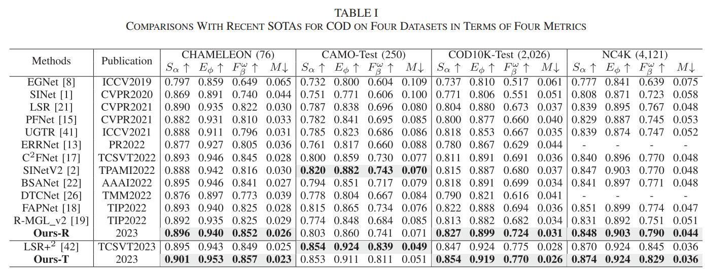
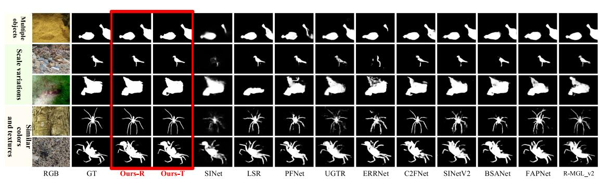

# Mask-and-Edge Co-Guided Separable Network for Camouflaged Object Detection (IEEE-SPL 2023)

> **Authors:** 
> Jiesheng Wu,
> Weiyun Liang,
> Fangwei Hao,
> and Jing Xu.

## 1. Preface

- This repository provides code for "_**Mask-and-Edge Co-Guided Separable Network for Camouflaged Object Detection**_" IEEE SPL 2023. [Paper](https://ieeexplore.ieee.org/document/10163250) 

## 2. Overview

### 2.1. Introduction

Camouflaged object detection (COD) involves segmenting objects that share similar patterns, such as color and texture, with their surroundings. Current methods typically employ multiple well-designed modules or rely on edge cues to learn object feature representations for COD. However, these methods still struggle to capture the discriminative semantics between camouflaged objects (foreground) and background, possibly generating blurry prediction maps. To address these limitations, we propose a novel mask-and-edge co-guided separable network (MECS-Net) for COD that leverages both edge and mask cues to learn more discriminative representations and improve detection performance. Specifically, we design a mask-and-edge co-guided separable attention (MECSA) module, which consists of three flows for separately
capturing edge, foreground, and background semantics. In addition, we propose a multi-scale enhancement fusion (MEF) module to aggregate multi-scale features of objects. The predictions are decoded in a top-down manner. Extensive experiments and visualizations demonstrate that our CNN-based and Transformer-based MECS-Net outperform 13 state-of-the-art methods on four popular COD datasets.

### 2.2. Framework Overview

      
    <em> 
    Figure 1: Overall architecture of our proposed MECS-Net. MECS-Net mainly consists of three parts: encoder (Res2Net is the default in the work), multi-scale enhancement fusion (MEF) module, and mask-and-edge co-guided separable attention (MECSA) module.
    </em>

### 2.3. Quantitative Results

      
    <em> 
    Figure 2: Quantitative Results
    </em>

### 2.4. Qualitative Results

      
    <em> 
    Figure 3: Qualitative Results.
    </em>

## 3. Proposed Method

### 3.1. Training/Testing

The training and testing experiments are conducted using [PyTorch](https://github.com/pytorch/pytorch) with two NVIDIA Tesla V100 GPUs of 32 GB Memory.

1. Configuring your environment (Prerequisites):
       
    + Installing necessary packages: `pip install -r requirements.txt`.

1. Downloading necessary data:

    + downloading training dataset and move it into `./data/`, 
    which can be found from [Baidu Drive](https://pan.baidu.com/s/1zLYWsxxluq1elQuyY7gg3w) (extraction code: ekd2). 

    + downloading testing dataset and move it into `./data/`, 
    which can be found from [Baidu Drive](https://pan.baidu.com/s/1xnaiHnAuj4UVTPRak9oU2g) (extraction code: nhwe). 
        
    + downloading our weights and move it into `./save_models/res_199.pth` or `./save_models/swin_199.pth`, 
    which can be found from [(Baidu Drive)](https://pan.baidu.com/s/1ONrkzCl1yoVEp2b9dbeFhQ) (extraction code: j1zt). 
    
    + downloading Res2Net or Swin V2 weights and move it into `./pre_train/res2net50_v1b_26w_4s-3cf99910.pth` or `./pre_train/swinv2_base_patch4_window12to24_192to384_22kto1k_ft.pth`,
    which can be found from [Baidu Drive](https://pan.baidu.com/s/18K3Rpk44Bu7JPq36aX1-PQ) (extraction code: izc5). 

1. Training Configuration:

    + After you download training dataset, just run `MyTrain.py` to train our model.

1. Testing Configuration:

    + After you download all the pre-trained model and testing dataset, just run `MyTest.py` to generate the final prediction maps.
    
    + You can also download prediction maps ('CHAMELEON', 'CAMO', 'COD10K', 'NC4K') from [Baidu Drive](https://pan.baidu.com/s/1VG3ftr5yzIOg9VSdN1149w) (extraction code: iuu6)).

### 3.2 Evaluating your trained model:

One evaluation is written in Python code ([link](https://github.com/lartpang/PySODMetrics)), 
please follow this the instructions in `MyEval.py` and just run it to generate the evaluation results.

## 4. Citation

Please cite our paper if you find the work useful, thanks!
	
	@article{wu2023mask,
	   title={Mask-and-Edge Co-Guided Separable Network for Camouflaged Object Detection},
	   author={Wu, Jiesheng and Liang, Weiyun and Hao, Fangwei and Xu, Jing},
	   journal={IEEE Signal Processing Letters},
	   year={2023},
	   publisher={IEEE}
	}
**[⬆ back to top](#1-preface)**
